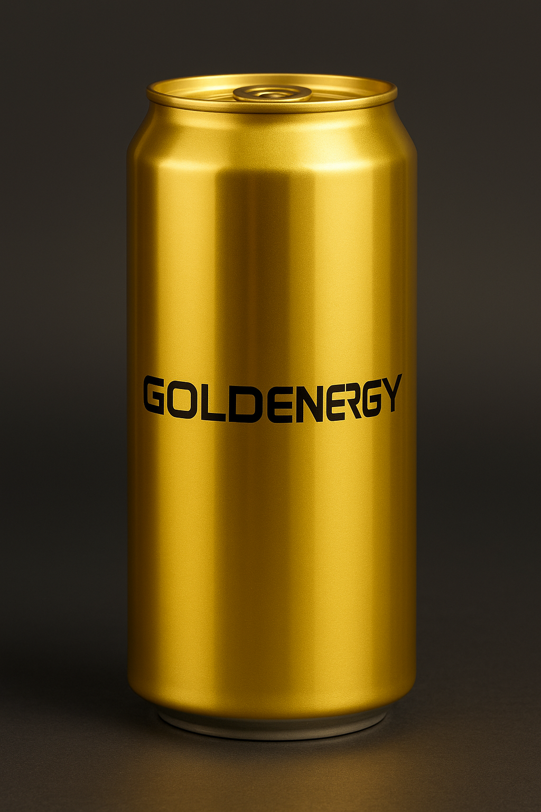

# Plantilla de Informe: Generación de Video con Wan 2.1

**Nota**: Esta es una plantilla en formato Markdown. Puedes convertirla a Word (.docx) usando herramientas como Pandoc o simplemente copiar el contenido a un documento Word y aplicar el formato correspondiente.

---

## Informe de Práctica: Generación de Producto Consistente en Múltiples Escenarios

**Nombre del Estudiante**: Antonio Lorenzo Díaz-Meco

---

## 1. Descripción del Producto y Escenarios

### 1.1. Producto Seleccionado

**Nombre del producto**: GOLDENergy – Bebida Energética Premium

**Características visuales principales**:

* **Color:** Dorado metálico brillante (hex: #FFD700), con acabado reflectante.
* **Forma:** Lata cilíndrica estándar de 330 ml, proporciones realistas.
* **Tamaño:** Aproximadamente 12 cm de alto y 6 cm de diámetro.
* **Elementos distintivos:**

  * Logo “GOLDENergy” en tipografía futurista negra centrada.
  * Diseño minimalista sin saturación gráfica.
  * Sin elementos decorativos adicionales (para facilitar consistencia entre escenas).
* **Material / Textura:** Metal reflectante premium, con reflejos marcados según la iluminación del entorno.

**Justificación de la selección**: Elegí GOLDENergy porque una lata metálica brillante es un objeto que **depende fuertemente de la iluminación, los reflejos y el color**. Esto lo convierte en un producto ideal para analizar:

* cómo los modelos generativos manejan la **consistencia del color metálico**,
* si la forma cilíndrica se mantiene estable,
* si el modelo respeta el **logo**,
* y cómo cambian los reflejos dependiendo del entorno.

Además, un producto con un diseño tan limpio permite detectar fácilmente pequeñas distorsiones o inconsistencias entre escenarios, lo que enriquece el análisis de la práctica.

## **1.2. Escenarios Seleccionados**

### **1. Gimnasio (Escenario Deportivo)**

* **Descripción:** Gimnasio moderno con pesas y máquinas de fondo, iluminación fluorescente dura.
* **Justificación:** El ambiente deportivo es relevante para un producto energético. Además, las luces fuertes ayudan a evaluar reflejos metálicos.

### **2. Cocina Moderna (Escenario Doméstico)**

* **Descripción:** Encimera de cocina con luz cálida natural y objetos cotidianos desenfocados.
* **Justificación:** Este escenario permite analizar si la lata mantiene coherencia visual en un entorno cotidiano y cálido.

### **3. Oficina (Escenario Profesional)**

* **Descripción:** Escritorio con laptop, documentos y luz fría LED.
* **Justificación:** La luz fría y la estética profesional ponen a prueba la fidelidad del color metálico y la nitidez del logo.

### **4. Terraza Exterior – Día Soleado**

* **Descripción:** Mesa exterior con plantas y cielo azul, fuerte luz solar directa.
* **Justificación:** La luz solar intensa genera reflejos duros que exigen mucha consistencia del material metálico.

### **5. Ciudad Nocturna (Escenario Urbano Nocturno)**

* **Descripción:** Mesa exterior con luces urbanas bokeh, farolas y reflejos azules.
* **Justificación:** La iluminación artificial de noche permite comprobar si el modelo mantiene el color dorado sin contaminarlo con colores del entorno.


---


# **2. Prompts Utilizados**

## **2.1. Descripción Base del Producto**

> “Lata de bebida energética GOLDENergy, cilíndrica, color dorado metálico brillante (#FFD700), textura reflectante premium, logo ‘GOLDENergy’ en negro con tipografía futurista centrado, diseño minimalista y elegante.”

Esta descripción sirve como núcleo común para todos los escenarios para maximizar consistencia.

---

## **2.2. Prompts por Escenario**

### **Escenario 1 – Gimnasio (T2V)**

```
Vídeo publicitario de una lata de bebida energética GOLDENergy, cilíndrica, color dorado metálico brillante (#FFD700), textura muy reflectante y pulida, logo "GOLDENergy" en letras negras centradas, diseño minimalista y premium. La cámara se mueve en un travelling suave desde la izquierda hacia la derecha y luego hace un giro de 360 grados alrededor de la lata, mientras la lata gira lentamente sobre su eje. Fondo de gimnasio moderno con pesas y máquinas desenfocadas, iluminación dramática con focos blancos fríos y reflejos dinámicos sobre el metal dorado, sensación de energía y potencia.
```

**Justificación:**
Incluí elementos típicos de un gimnasio (pesas, máquinas) para reforzar la ambientación. También añadí “reflejos dinámicos” y “rotación lenta” para ayudar al modelo a entender el movimiento deseado. El prompt guía cómo debe comportarse la luz en el metal para evitar inconsistencias.

---

### **Escenario 2 – Cocina Moderna (I2V)**

```
Lata de bebida energética GOLDENergy, cilíndrica, color dorado metálico brillante (#FFD700), logo “GOLDENergy” en negro centrado, textura reflectante premium. La lata está sobre una encimera de cocina moderna, con utensilios y plantas al fondo, iluminación cálida natural de ventana. Ambiente acogedor y relajado. La cámara orbita suavemente alrededor de la lata mostrando su brillo dorado.
```

**Justificación:**
La elección de luz cálida natural ayuda a probar cómo se adapta el metal a un ambiente doméstico. La cámara orbitando simula una toma comercial profesional. Este prompt favorece consistencia gracias al uso de imagen de referencia.

---

### **Escenario 3 – Oficina (I2V)**

```
Lata de bebida energética GOLDENergy, cilíndrica, dorado metálico brillante (#FFD700), logo negro centrado, diseño premium minimalista. La lata está sobre un escritorio de oficina moderna con un portátil y documentos al fondo, iluminación LED profesional fría. Ambiente corporativo y elegante. La lata permanece estática mientras la cámara hace un zoom lento hacia el logo.
```

**Justificación:**
Aquí la luz fría pone a prueba el color dorado, que tiende a virar hacia tonos verdosos si el modelo no es consistente. El zoom lento sobre el logo permite evaluar la nitidez de la marca.

---

### **Escenario 4 – Terraza Exterior Día (T2V)**

```
Vídeo publicitario dinámico de una lata de bebida energética GOLDENergy, cilíndrica, dorado metálico brillante (#FFD700), textura muy reflectante, logo negro “GOLDENergy” perfectamente centrado. 
La lata está sobre una mesa exterior en una terraza luminosa con plantas moviéndose suavemente por el viento y cielo azul brillante al fondo.

Iluminación natural del sol del mediodía con reflejos dinámicos que cambian mientras la cámara se mueve.

La cámara realiza un travelling hacia adelante mientras gira ligeramente alrededor de la lata (movimiento orbital suave). 
Pequeño balanceo natural de cámara, profundidad de campo cinematográfica y reflejos del sol animados sobre la superficie metálica.
Ambiente veraniego vibrante, sensación de aire fresco y movimiento ambiental (hojas, sombras del sol cambiando lentamente).

```

**Justificación:**
Este prompt fuerza al modelo a generar reflejos fuertes debido a la luz del sol. Añadí “sombras definidas” para asegurar buena iluminación y “reflejos solares” para destacar el metal.
Tuve que cambair el prompt, este nuevo introduce movimiento explícito tanto en la cámara como en el entorno, lo cual era necesario porque el modelo generaba un fondo completamente estático. Añadí travelling, giro orbital y balanceo para forzar dinamismo de cámara, y elementos ambientales animados (plantas movidas por el viento, sombras cambiantes) para evitar la sensación de “foto fija”. También reforcé los reflejos dinámicos del sol para mejorar la interacción de la luz con el metal dorado. Con ello se busca obtener un vídeo más fluido y publicitario, manteniendo la identidad visual del producto.
---

### **Escenario 5 – Ciudad Nocturna (T2V)**

```
Lata de energía GOLDENergy, cilíndrica, dorado metálico brillante, logo negro centrado. La lata está sobre una mesa exterior con la ciudad nocturna de fondo, luces urbanas bokeh, farolas cálidas y reflejos azules. Iluminación artificial contrastada, ambiente moderno y urbano. La lata permanece fija mientras las luces de la ciudad se reflejan en su superficie metálica.
```

**Justificación:**
Utilicé términos como “bokeh”, “luces urbanas” y “reflejos azules” para lograr un ambiente nocturno realista. El contraste de luces cálidas y azules es típico de escenas comerciales premium.
Modifiqué el prompt original para que la escena fuera mucho más dinámica. Ahora especifico travelling y movimiento orbital de cámara, así como luces de neón y tráfico en movimiento que se reflejan en el metal. Esto debería reducir la sensación de plano estático y aprovechar mejor el modelo T2V para generar una escena nocturna más cinematográfica, manteniendo a la vez la identidad dorada y metálica de la lata GOLDENergy.

---

## **2.3. Modificaciones y Ajustes Realizados**

Durante el proceso de generación hice diversas mejoras en los prompts para obtener mayor consistencia.
Los cambios principales fueron:

### **1. Pasar de prompts cortos a prompts largos y detallados**

Al principio mis prompts eran muy breves (“lata dorada en un gimnasio”), y eso generaba:

* cambios en el diseño de la lata,
* variación del logo,
* cambios en la forma o proporciones.

Solución:
 Añadí **descripciones detalladas de color, textura, luz y movimiento**, siguiendo las recomendaciones del student guide.

### **2. Especificar iluminación con precisión**

Descubrí que la luz afecta mucho al color del metal.
Pasé de “luz natural” a:

* “iluminación cálida natural de ventana”,
* “fluorescente intensa”,
* “luz LED fría”,
* “sol del mediodía con sombras duras”.

Esto redujo variaciones no deseadas en el color dorado.

### **3. Añadir acciones de cámara**

En algunos escenarios el modelo hacía movimientos erráticos.
Añadí instrucciones como:

* “rotación lenta”,
* “zoom suave”,
* “cámara orbitando lentamente”.

Esto produjo vídeos más estables y profesionales.

### **4. Reforzar el diseño minimalista**

Inicialmente la lata a veces cambiaba de estilo o añadía decoraciones.
Añadí sistemáticamente:
“diseño minimalista y elegante”.

Esto ayudó a estabilizar el aspecto gráfico.

### **5. Introducir siempre la descripción base al inicio**

Esto aumentó mucho la consistencia entre escenarios.
El modelo necesita repetición literal para fijar la identidad del producto.

---

# 3. Resultados

## 3.1. Imagen de Referencia



**Descripción**: Imagen estática de estudio de la lata GOLDENergy sobre un fondo gris neutro. La lata aparece perfectamente cilíndrica, con proporciones realistas, material metálico dorado brillante homogéneo y reflejos suaves. El logo “GOLDENERGY” se lee con total nitidez, en color negro, centrado horizontalmente y sin deformaciones. Esta imagen sirve como **definición visual canónica** del producto: color, forma y tipografía correctos.


## 3.2. Videos Generados

## **3.1. Escenario 1 – Gimnasio (T2V)**

**Video:** 't2v-1.3B_832*480_1_1_V'$'\303\255''deo_publicitario_de_una_lata_de_bebida_energ'$'\303\251''tic_20251125_180828.mp4'


### **Frame 1**

📸 *(Imagen proporcionada)*

**Descripción:**
En este frame el movimiento es visible y la iluminación del gimnasio está bien lograda (luces frías, ambiente industrial). Sin embargo, el logo aparece deformado ("GONLEENgy") y estirado horizontalmente. La parte inferior de la lata tiene una prominencia irregular que no debería existir en un objeto rígido.

**Observaciones técnicas:**

* La forma cilíndrica no se mantiene: la base parece “aplastada” o “abombada”.
* La lata parece de plástico blando en vez de metal rígido.
* El logo se distorsiona debido a la incapacidad del modelo T2V para generar texto estable.

---

### **Frame 2**

📸 *(Imagen proporcionada)*

**Descripción:**
La iluminación se intensifica (foco trasero fuerte), lo que genera un buen reflejo metálico. No obstante, el texto vuelve a cambiar (“GOLLEENEY”), confirmando la falta de consistencia tipográfica. El cuerpo de la lata está descentrado y parece inclinado sobre un eje no físico.

**Observaciones técnicas:**

* El diseño se mantiene dorado, pero la geometría vuelve a ser imperfecta.
* El contorno de la lata se ondula al rotar.
* El logo cambia pero sigue recordando vagamente la forma negra horizontal.

---

### **Frame 3**

📸 *(Imagen proporcionada)*

**Descripción:**
En este frame se observa claramente cómo el cuerpo de la lata se deforma con un desplazamiento irregular hacia un lado. El logo vuelve a mutar y su alineación no coincide con la rotación del cilindro.

**Observaciones técnicas:**

* La forma no es consistente: la lata se curva y se estrecha donde no debería.
* El área superior e inferior pierde simetría.
* El texto vuelve a ser ilegible e inconsistente.

---

### **Conclusión del escenario 1**

La versión mejorada del prompt **sí consiguió aumentar el dinamismo del vídeo**, pero:

1. **La forma del producto sigue siendo inestable** (problema común de T2V con objetos rígidos).
2. **El logo nunca se mantiene legible ni consistente**.
3. **El movimiento de cámara añade atractivo, pero también magnifica las deformaciones** del objeto.

## **3.1. Escenario 2 - Cocina Moderna (I2V)**

**Video**: 'i2v-14B_832*480_1_1_Lata_de_bebida_energ'$'\303\251''tica_GOLDENergy,_cil'$'\303\255''ndrica,__20251125_184815.mp4'

El vídeo se ha generado con el modo **I2V 14B** usando como **imagen de referencia** `recursos/goldenergy.png`.

### Frame 1

📸 *(primer frame de la cocina)*

**Descripción:**  
La lata aparece casi centrada en la imagen, sobre una encimera cálida con fondo ligeramente desenfocado. La iluminación entra desde la derecha simulando una ventana, creando un reflejo vertical suave en el cuerpo de la lata. El color dorado es muy similar al de la imagen de referencia: metálico, uniforme y creíble. Se alcanza a leer con claridad el inicio del logo “GOLD…”, con grosor y estilo de letra coherentes con la referencia.

**Observaciones técnicas:**

- La **forma cilíndrica** se mantiene muy bien: bordes rectos, base y tapa circulares, sin deformaciones visibles.
- El **material metálico** está muy bien resuelto: brillo controlado, sin ruidos ni artefactos extraños.
- El **entorno** (encimera, fondo ligeramente verdoso con planta) es correcto pero bastante estático, con muy poca sensación de movimiento de cámara.

---

### Frame 2

📸 *(segundo frame de la cocina)*

**Descripción:**  
La cámara parece haberse desplazado ligeramente, mostrando la lata más girada hacia la derecha. El logo queda parcialmente fuera de campo, pero la parte visible sigue siendo coherente con la referencia (mismo grosor de trazo, color negro limpio). El fondo muestra claramente la planta y las lamas de la persiana con luz cálida entrando por la ventana.

**Observaciones técnicas:**

- La **consistencia de color** es excelente: el dorado mantiene el mismo tono y nivel de brillo que en el frame anterior y que en la referencia.
- La **forma** continúa siendo rígida y estable, sin “abombamientos” ni curvaturas raras en la base o el cuerpo.
- El **fondo** apenas cambia: la cámara se mueve poco y da sensación de “foto animada” más que de plano publicitario dinámico.

---

### Frame 3

📸 *(tercer frame de la cocina)*

**Descripción:**  
La lata aparece de nuevo prácticamente en el mismo punto, pero ahora con un giro suficiente como para que el logo solo se vea parcialmente en el borde derecho. Los reflejos en el metal siguen siendo suaves y creíbles, adaptados a la misma luz cálida de ventana. El entorno (planta verde y persiana) continúa muy estable.

**Observaciones técnicas:**

- La **geometría** del producto se mantiene impecable durante toda la secuencia: no se observan deformaciones ni cambios de proporción al girar la lata.
- La **marca** se conserva razonablemente bien: aunque el texto no se ve siempre completo, las letras que aparecen son legibles y no mutan entre frames.
- La **coherencia temporal** es buena pero limitada: hay continuidad entre frames, sin “saltos”, pero el movimiento de cámara es muy sutil, mucho más discreto de lo descrito en el prompt (“la cámara orbita suavemente alrededor de la lata”).

---

### **Conclusión del escenario 2**

En el escenario de cocina, al usar **Image-to-Video con una imagen de referencia**, el modelo:

1. **Mejora de forma clara la fidelidad del producto**: la lata mantiene su forma cilíndrica rígida, el color dorado metálico es prácticamente idéntico al de la referencia y el logo se respeta mucho mejor que en el escenario 1.
2. **Reduce las deformaciones y artefactos**: no se observan bases “blandas” ni cambios de volumen al girar, y el texto no se desfigura de forma extrema.
3. **Sacrifica espectacularidad en el entorno y el movimiento**: la cocina funciona más como un fondo estático; la cámara apenas orbita y el vídeo se percibe más como una imagen fija con ligeros cambios de punto de vista que como un anuncio muy dinámico.

En resumen, **el uso de referencia I2V equilibra el problema principal del escenario 1** (inconsistencia del logo y de la forma) a cambio de un entorno menos llamativo y un movimiento de cámara mucho más conservador.

## **3.1.  Escenario 3 - Oficina (I2V)**

**Video**: 'i2v-14B_832*480_1_1_Lata_de_bebida_energ'$'\303\251''tica_GOLDENergy,_cil'$'\303\255''ndrica,__20251125_190331.mp4'


El vídeo se ha generado con el modo **I2V 14B** usando como **imagen de referencia** la misma `recursos/goldenergy.png` que en el escenario 2.

### Frame 1

📸 *(primer frame oficina – imagen base)*

**Descripción:**
El primer frame es prácticamente **idéntico a la imagen de referencia**: fondo gris neutro, lata completamente centrada, proporciones perfectas y logo “GOLDENERGY” perfectamente legible. No hay todavía elementos de oficina ni portátil; visualmente parece una foto de estudio del producto.

**Observaciones técnicas:**

* La **forma cilíndrica** es impecable: bordes rectos, tapa y base circulares, sin deformaciones.
* El **color dorado metálico** coincide con la referencia, con reflejos suaves y uniformes.
* El **logo** se ve nítido, sin artefactos ni mutaciones en las letras.
* Este frame funciona como **ancla visual**: define el “estado canónico” del producto antes de entrar en el entorno de oficina.

---

### Frame 2

📸 *(segundo frame oficina – aparece el portátil)*

**Descripción:**
En el segundo frame ya se aprecia el entorno de oficina: detrás de la lata se ve claramente un **portátil abierto** con pantalla azulada y teclado desenfocado. La lata sigue ocupando el centro de la composición, con el logo “GOLDENERGY” perfectamente legible. La luz principal ahora parece provenir de la pantalla del portátil, generando un **brillo frío** que se refleja en el metal dorado.

**Observaciones técnicas:**

* La **consistencia de forma** sigue siendo excelente: no hay cambios en la geometría del cilindro ni en la base.
* El **color** se adapta ligeramente al nuevo entorno: el dorado mantiene su tono, pero aparecen reflejos fríos azulados coherentes con la pantalla del portátil.
* El **logo** mantiene la misma tipografía, tamaño y posición que en el frame 1; no hay deformaciones ni cambios de texto.
* El **fondo** es simple pero claro: solo el portátil y la mesa, sin elementos adicionales como papeles o accesorios de oficina.

---

### Frame 3

📸 *(tercer frame oficina – evolución de la luz)*

**Descripción:**
En el tercer frame el encuadre es muy similar al segundo, pero se aprecia que el **portátil se ha abierto más** y la luz de la pantalla es algo más intensa. El fondo azul se vuelve más uniforme y brillante, y esto se traduce en un cambio sutil en los **reflejos del metal dorado**: la zona central de la lata refleja más luz, generando un highlight más fuerte. La lat a sigue frontal, sin cambios apreciables de posición.

**Observaciones técnicas:**

* La **geometría de la lata** se mantiene perfectamente rígida y consistente entre frames: no hay estiramientos ni “abombamientos”.
* El **logo** continúa siendo completamente legible y estable; no hay mutaciones de letras entre frames.
* La **coherencia temporal** es buena: se percibe una transición suave en la iluminación (pantalla que se abre/enciende) sin saltos ni artefactos.
* Igual que en el escenario 2, el **movimiento de cámara** es mínimo: el efecto cinematográfico viene más por el cambio de luz y del portátil que por una verdadera “toma de zoom” como la descrita en el prompt.

---

### **Conclusión del escenario 3**

En el escenario de oficina, el modo **I2V con referencia** vuelve a mostrar un comportamiento muy estable respecto al producto:

1. **Máxima fidelidad al diseño del producto**:

   * La lata mantiene **forma, tamaño y proporciones** prácticamente idénticas a la referencia durante todo el vídeo.
   * El **logo “GOLDENERGY” se conserva perfecto** en todos los frames, algo que el modelo T2V no consigue en el escenario 1.

2. **Excelente consistencia de color y material**:

   * El dorado metálico se mantiene estable; solo cambian los reflejos en función de la luz de la pantalla del portátil.
   * El material sigue pareciendo metal rígido y premium, sin sensación de plástico blando ni deformaciones.

3. **Entorno más simple y menos “publicitario”**:

   * Aunque el prompt pedía un escritorio con documentos y un ambiente corporativo más rico, en la práctica el fondo se reduce casi por completo a **mesa + portátil**, con el portátil como única fuente de dinamismo.
   * El resultado es visualmente limpio, pero menos espectacular y complejo que el escenario del gimnasio.

4. **Dominio claro de la imagen de referencia**:

   * Igual que en la cocina, se aprecia que el modelo **prioriza mantener exactamente la apariencia de la lata** frente a introducir mucha variación en la escena.
   * Esto confirma que, en I2V, la referencia actúa como una fuerte “ancla” que favorece la consistencia del producto a costa de creatividad en el entorno y el movimiento.

En resumen, el escenario 3 demuestra que **I2V es muy adecuado para anuncios donde lo importante es la fidelidad al producto (logo, forma, color)**, aunque el resultado sea menos dinámico y con fondos más sencillos que los generados exclusivamente con T2V.


## **3.1.  Escenario 4 - Terraza Exterior Día (T2V)**

**Video**: 't2v-1.3B_832*480_1_1_V'$'\303\255''deo_publicitario_din'$'\303\241''mico_de_una_lata_de_bebida__20251125_191957.mp4'

El vídeo se ha generado con el modo **T2V 1.3B** usando únicamente texto, sin imagen de referencia. El objetivo era conseguir un plano más dinámico en una terraza soleada, con movimiento tanto en la cámara como en el entorno (plantas, iluminación).

### Frame 1

📸 *(primer frame terraza)*

**Descripción:**  
La lata aparece en el centro de la imagen, sobre una mesa brillante en una terraza rodeada de plantas verdes. El cielo es muy azul y el sol entra desde la izquierda con un reflejo muy fuerte en la superficie metálica. El texto del logo no es exactamente “GOLDENergy”, sino algo similar a “GOLNENDN”, claramente incorrecto. Aun así, mantiene una franja negra ovalada rodeando la lata que recuerda a la banda del logo.

**Observaciones técnicas:**

- **Color**: el dorado es muy intenso y saturado, con un aspecto casi “cartoon”, pero coherente con la idea de producto energético veraniego.
- **Forma**: la lata mantiene una silueta cilíndrica general, pero la parte superior y la base se ven ligeramente deformadas, como si el metal fuera demasiado blando.
- **Logo**: el texto es erróneo y algo irregular, aunque se mantiene como banda negra horizontal centrada.

---

### Frame 2

📸 *(segundo frame terraza)*

**Descripción:**  
La cámara se ha desplazado ligeramente hacia la izquierda y las plantas del fondo han cambiado de posición, reforzando la sensación de movimiento. La lata sigue centrada, pero ahora se aprecia mejor la banda del logo, que sigue leyendo algo parecido a “GOLNENDN”. La luz del sol crea nuevos reflejos verticales en el cuerpo de la lata, diferentes a los del frame 1.

**Observaciones técnicas:**

- **Movimiento de cámara**: se percibe un cambio de plano real (no es solo “parpadeo” de ruido), con ligera variación de ángulo y composición.
- **Entorno**: las hojas parecen moverse entre frames, lo que añade dinamismo y sensación de viento suave.
- **Consistencia de texto**: aunque el logo es incorrecto, la forma de las letras y la banda negra se mantienen muy similares al frame 1 (error, pero **consistente**).

---

### Frame 3

📸 *(tercer frame terraza)*

**Descripción:**  
En el último frame la lata sigue en la misma mesa, pero ahora más desplazada hacia la derecha dentro del encuadre: se ve mucho más cielo azul a la izquierda y un bloque de plantas más denso a la derecha. El brillo del metal cambia otra vez: aparecen reflejos más anchos y el contorno de la lata se ve ligeramente más estrecho. El logo sigue siendo ilegible como marca real, pero conserva la misma estructura general que en los frames anteriores.

**Observaciones técnicas:**

- **Coherencia temporal**: el vídeo transmite un movimiento suave de cámara lateral, junto con un cambio gradual de iluminación y de posición relativa de las plantas.
- **Forma de la lata**: se mantiene la idea de cilindro dorado, pero la geometría no es perfectamente rígida; la silueta se “retuerce” un poco según cambia el plano.
- **Logo**: se confirma que el modelo no es capaz de reproducir el texto “GOLDENergy” de forma correcta, pero sí mantiene un diseño similar frame a frame (misma banda negra, mismas proporciones aproximadas).

---

### **Conclusión del escenario 4**

En la terraza exterior, el modelo **T2V** consigue por fin:

1. **Buen dinamismo de escena**:  
   - Hay movimiento real de cámara (cambio de plano y de composición).
   - Las plantas del fondo se desplazan entre frames, dando sensación de aire y vida en el entorno.
   - La iluminación solar produce reflejos cambiantes y creíbles sobre el metal.

2. **Color muy atractivo pero poco realista**:  
   - El dorado es brillante y llamativo, reforzando la idea de bebida energética veraniega.
   - Sin embargo, el nivel de saturación es tan alto que se acerca a un look más “ilustración 3D” que fotografía realista.

3. **Problemas de fidelidad del producto**:  
   - La **forma de la lata** no es completamente rígida; se deforma ligeramente según cambia el plano.
   - El **logo nunca coincide con “GOLDENergy”**, aunque mantiene una banda negra con texto pseudo-legible que es bastante consistente entre frames.

En resumen, el escenario 4 demuestra que **T2V es bueno generando escenas dinámicas y coloridas con movimiento ambiental**, pero sigue teniendo dificultades importantes para respetar la geometría exacta y, sobre todo, la **marca y el texto** del producto, incluso cuando la descripción del prompt es muy precisa.

## **3.1.  Escenario 5 - Ciudad Nocturna (T2V)**

**Video**: 't2v-1.3B_832*480_1_1_V'$'\303\255''deo_publicitario_nocturno_de_una_lata_de_bebida__20251125_193151.mp4'


El vídeo se ha generado con el modo **T2V 1.3B** usando solo texto. El objetivo era obtener una escena urbana nocturna dinámica, con tráfico y luces de neón reflejadas en la lata GOLDENergy.

### Frame 1

📸 *(primer frame ciudad noche)*

**Descripción:**
La lata dorada aparece sobre una superficie brillante, ligeramente a la derecha del centro. El fondo muestra una autopista curva con estelas de luces rojas y blancas y edificios iluminados al fondo. El logo no es exactamente “GOLDENergy”, sino algo similar a “GONEeAY/GONEeGY”, claramente incorrecto, pero colocado en la parte inferior de la lata. El dorado es muy intenso y las reflexiones verticales ocupan casi todo el cuerpo del cilindro.

**Observaciones técnicas:**

* **Color:** dorado metálico muy saturado, con reflejos verticales fuertes que refuerzan la idea de luz de neón reflejada.
* **Forma:** la lata es reconociblemente cilíndrica, aunque la base parece algo estrecha y ligeramente “apretada”.
* **Logo:** texto incorrecto, pequeño y situado muy abajo, pero ya se marca una forma de banda negra con letras claras.
* **Fondo:** muy logrado visualmente, con bokeh y luces azules/rosas que encajan bien con la idea de ciudad nocturna.

---

### Frame 2

📸 *(segundo frame ciudad noche)*

**Descripción:**
La cámara parece haberse desplazado hacia la izquierda y algo hacia atrás: ahora se ve mejor la autopista, incluso se distingue un coche rojo desenfocado en movimiento. La lata parece ligeramente más pequeña y algo más baja en el encuadre, como si hubiera cambiado de escala. El logo sigue siendo ilegible como marca real, pero mantiene una palabra similar a “GONEeGY” con misma posición y estilo general.

**Observaciones técnicas:**

* **Cambio de tamaño:** entre el frame 1 y el 2 la lata **cambia de escala**, haciéndose algo más pequeña respecto al fondo; no parece solo un efecto de zoom, sino una inconsistencia de tamaño.
* **Iluminación:** las zonas iluminadas del metal cambian; aparecen nuevas franjas de luz procedentes de los faros de los coches y de los neones del fondo.
* **Logo:** aunque incorrecto, la banda negra con texto es bastante consistente entre frames en forma y posición.
* **Entorno dinámico:** el coche rojo y las estelas de luz refuerzan la sensación de tráfico nocturno en movimiento.

---

### Frame 3

📸 *(tercer frame ciudad noche)*

**Descripción:**
En el último frame la cámara parece haberse desplazado hacia la derecha y un poco más cerca de la lata. La lata vuelve a verse más grande, ocupando más altura en el encuadre. El fondo de ciudad se mantiene con edificios y puntos de luz bokeh, pero las estelas de la autopista ya no son tan protagonistas. El texto del logo sigue siendo incorrecto, pero conserva la misma estructura general de palabra corta en negro en la parte baja del cilindro.

**Observaciones técnicas:**

* **Escala y posición:** se vuelve a notar un cambio en el tamaño relativo de la lata respecto al fondo (ahora más grande otra vez), lo que rompe un poco la coherencia geométrica.
* **Color e iluminación:** el dorado mantiene su tono general, pero los reflejos cambian de forma brusca entre frames, con diferentes columnas de luz que no siempre siguen un patrón suave.
* **Logo:** error tipográfico persistente, pero relativamente estable en forma (mismas letras deformadas, misma zona de la lata).
* **Fondo:** muy agradable estéticamente, con mezcla de luces cálidas y frías que dan una buena atmósfera urbana nocturna.

---

### **Conclusión del escenario 5**

En la escena de **ciudad nocturna**, el modelo T2V muestra:

1. **Fondo muy atractivo y coherente**

   * Las luces azules y rojas de neones y coches crean una atmósfera nocturna convincente y cinematográfica.
   * La autopista curva y las estelas de luz transmiten dinamismo y movimiento continuo.

2. **Buena consistencia de color del producto, con matices**

   * El dorado metálico se mantiene vibrante en todos los frames.
   * Los cambios de iluminación son coherentes con el entorno nocturno, aunque a veces los reflejos cambian de forma algo brusca.

3. **Problemas de forma y escala**

   * El tamaño relativo de la lata **varía entre frames** (se hace más grande/pequeña) sin que se explique del todo por el movimiento de cámara.
   * La geometría del cilindro es aceptable, pero no tan rígida como en I2V: la base y la parte superior se ven ligeramente deformadas en algunos momentos.

4. **Logo incorrecto pero relativamente estable**

   * Ningún frame muestra correctamente la palabra “GOLDENergy”; el modelo genera variantes como “GONEeGY”.
   * Sin embargo, la banda negra con texto se mantiene consistente en posición y estilo a lo largo del vídeo.

En conjunto, el escenario 5 confirma el patrón visto en otros T2V: **gran capacidad para generar entornos ricos y dinámicos**, con buenas luces y movimiento, pero **dificultades claras para mantener la escala precisa del producto y reproducir fielmente el logo y el texto**.

---

## 4. Análisis de Consistencia

### 4.1. Tabla Comparativa de Consistencia

| Escenario                               | Consistencia de Color | Consistencia de Forma | Consistencia de Logo/Marca | Coherencia Temporal | Artefactos Visuales | Nota General |
| --------------------------------------- | --------------------- | --------------------- | -------------------------- | ------------------- | ------------------- | ------------ |
| **Escenario 1 – Gimnasio (T2V)**        | Bueno                 | Pobre                 | Pobre                      | Bueno               | Moderados           | **4/10**     |
| **Escenario 2 – Cocina (I2V)**          | Excelente             | Excelente             | Bueno                      | Bueno               | Leves               | **8/10**     |
| **Escenario 3 – Oficina (I2V)**         | Excelente             | Excelente             | Excelente                  | Bueno               | Leves               | **9/10**     |
| **Escenario 4 – Terraza Día (T2V)**     | Bueno                 | Regular               | Pobre                      | Bueno               | Moderados           | **6/10**     |
| **Escenario 5 – Ciudad Nocturna (T2V)** | Bueno                 | Regular               | Pobre                      | Bueno               | Moderados           | **6.5/10**   |


### 4.2. Análisis Detallado por Dimensión


#### **4.2.1. Consistencia de Color**

**Análisis:**
La consistencia del color dorado metálico varía significativamente entre T2V e I2V:

* **I2V (Escenarios 2 y 3)**: el color es **altamente consistente**, prácticamente idéntico al de la imagen de referencia, con cambios únicamente en los reflejos generados por la iluminación del entorno (ventana en cocina, pantalla azulada en oficina).
* **T2V (Escenarios 1, 4 y 5)**: el dorado se mantiene reconocible, pero:

  * en el gimnasio aparece más apagado o blando,
  * en la terraza es extremadamente saturado (casi “cartoon”),
  * en la ciudad nocturna se tiñe de reflejos azulados y rosas, a veces de forma abrupta.

**Ejemplos de inconsistencias:**

* Escenario 4: el dorado cambia demasiado entre frames, con reflejos que no siguen un patrón suave.
* Escenario 5: el metal a veces se vuelve exageradamente reflectante, distorsionando la silueta.

**Factores que afectan la consistencia:**

* Luz ambiental (natural vs neón).
* Presencia de objetos luminosos móviles (coches, sol fuerte).
* Ausencia de referencia visual en T2V.

---


###3 **4.2.2. Consistencia de Forma**

**Análisis:**
La forma cilíndrica del producto solo es perfectamente conservada en **I2V (Escenarios 2 y 3)**. Con T2V, la geometría es mucho más inestable.

**Ejemplos de inconsistencias:**

* Escenario 1: la lata aparece “blanda”, con base aplastada y ondulaciones al rotar.
* Escenario 4: la parte superior y base cambian de anchura entre frames, especialmente cuando la cámara se mueve.
* Escenario 5: cambios de escala entre frames (la lata se hace más grande/pequeña sin justificación de cámara).

**Factores que afectan la consistencia:**

* Falta de restricción geométrica en T2V.
* Movimiento de cámara excesivo.
* Reflejos ambientales exagerados que engañan al modelo.
* Complejidad del fondo y de las fuentes de luz.

---

#### **4.2.3. Consistencia de Logo/Marca**

**Análisis:**
Esta es la dimensión **más problemática**, especialmente para modelos T2V.

* **Escenarios 1, 4 y 5 (T2V)**:

  * El texto **jamás se reproduce correctamente** (“GONLEENgy”, “GOLNENDN”, “GONEeGY”…).
  * Aun así, en escenarios 4 y 5, el diseño erróneo es **estable entre frames**: error consistente.
* **Escenarios 2 y 3 (I2V)**:

  * El logo es sorprendentemente **fiel**, nítido y estable.
  * En oficina, el logo es perfecto en los 3 frames.

**Ejemplos de inconsistencias:**

* Escenario 1: el logo cambia forma y grosor en cada frame.
* Escenario 5: el texto no es legible como marca real y cambia ligeramente forma entre frames.

**Factores que afectan la consistencia:**

* La generación de texto es uno de los puntos débiles de T2V.
* La presencia de movimiento rápido o fondos complejos.
* La ausencia de referencia en T2V.

---

#### **4.2.4. Coherencia Temporal**

**Análisis:**
Todos los videos mantienen cierta continuidad temporal, pero la calidad varía.

* **I2V (Escenarios 2 y 3)**:

  * La coherencia es buena, con transiciones suaves y estabilidad en forma, tamaño y color.
  * El movimiento es limitado, pero estable.

* **T2V (Escenarios 1, 4 y 5)**:

  * La coherencia temporal es razonable, pero:

    * hay microcambios no naturales (forma de la lata, tamaño relativo),
    * los reflejos cambian de forma abrupta,
    * el logo muta aunque mantenga ubicación general.

**Ejemplos:**

* Escenario 4: movimiento de cámara realista pero lat a cambia estructura según encuadre.
* Escenario 5: el tamaño de la lata varía sin explicación.

---
#### **4.2.5. Artefactos Visuales**

**Análisis:**
La presencia de artefactos depende fuertemente del modo:

* **I2V** → artefactos mínimos:

  * reflejos suaves,
  * logos nítidos,
  * sin deformaciones extrañas.

* **T2V** → artefactos moderados:

  * deformaciones geométricas,
  * texto borroso o inventado,
  * cambios de escala,
  * contornos “gelatinosos”.

**Ejemplos documentados:**

* Escenario 1: base abombada y contorno ondulante.
* Escenario 4: silueta se estrecha y expande entre frames.
* Escenario 5: reflejos exagerados que distorsionan la forma visible del cilindro.

---


### **4.3. Comparación Entre Escenarios**

**Mejor rendimiento:**

#### **Escenario 3 – Oficina (I2V)**

* Color perfecto
* Forma extremadamente estable
* Logo impecable
* Reflejos coherentes
* Movimientos de luz suaves
  Es el escenario más profesional y el que reproduce fielmente el diseño del producto.

**Segundo mejor:**

#### **Escenario 2 – Cocina (I2V)**

Muy consistente, aunque con poco dinamismo.

---

### **Peor rendimiento:**

#### **Escenario 1 – Gimnasio (T2V)**

* Logo ilegible y mutante
* Forma deformada
* Artefactos muy visibles
* El movimiento de cámara amplifica los errores

---

#### **Análisis de diferencias**

La causa principal de las diferencias entre escenarios es el tipo de modelo:

* **I2V (con imagen de referencia)** →
  Favorece **fidelidad absoluta al producto**, sacrificando dinamismo.

* **T2V (solo texto)** →
  Favorece **escenas muy dinámicas y creativas**, pero pierde:

  * forma rígida del producto,
  * logo correcto,
  * tamaño consistente,
  * estabilidad geométrica.

Además:

* La iluminación compleja (sol directo o luces de ciudad) **incrementa el riesgo de deformaciones**.
* Los movimientos de cámara aceleran las inconsistencias.
* El texto en superficies curvas es especialmente difícil para T2V.
---

## 5. Reflexión Final

### 5.1. Capacidades del Modelo

A lo largo de la práctica he comprobado que Wan 2.1 es muy potente generando **escenas cinematográficas** con buena composición, profundidad de campo y manejo de la luz. En los escenarios T2V (terraza y ciudad nocturna) el modelo produce fondos complejos, con bokeh, neones, tráfico en movimiento y reflejos dinámicos que resultan muy atractivos visualmente.
En modo I2V, su principal fortaleza es la **fidelidad al producto de referencia**: mantiene con mucha precisión la forma cilíndrica, el material metálico y, sobre todo, el logo, incluso cuando cambia la iluminación (cocina vs oficina). En general, el modelo se desempeña mejor cuando:

* Tiene una **imagen de referencia clara** (I2V).
* El producto es el foco principal y el movimiento de cámara es moderado.
* Hay que generar **publicidad estática o semidinámica** donde la prioridad es respetar el diseño del objeto.

---

### 5.2. Limitaciones Identificadas

La limitación más importante observada es la **inconsistencia en el texto y la marca** cuando se trabaja solo con T2V: el logo nunca se reproduce correctamente y las letras cambian entre frames. Además, con T2V la **geometría del objeto rígido** (la lata) tiende a deformarse: bases abombadas, cambios de ancho y variaciones de escala no explicadas por la cámara.
También se aprecian problemas de **estabilidad temporal** en detalles finos: los reflejos cambian de forma brusca y el tamaño relativo de la lata fluctúa, especialmente en la ciudad nocturna. Estas limitaciones se agravan cuando:

* El fondo es muy complejo o tiene muchas fuentes de luz en movimiento.
* El texto es pequeño y se coloca sobre una superficie curva.
* El prompt exige mucho dinamismo de cámara sin aportar una referencia visual.

---

### 5.3. Aprendizajes sobre Ingeniería de Prompts

De la práctica saco varias lecciones claras de prompt engineering:

1. **Detalle por encima de brevedad**: los prompts largos y específicos (color exacto, tipo de iluminación, textura, movimiento de cámara) producen resultados mucho más controlados que descripciones genéricas como “lata dorada en un gimnasio”.
2. **Estructurar el prompt en capas**: primero describir el producto (forma, material, logo), después el entorno y por último el tipo de movimiento. Esta estructura ayuda al modelo a “anclar” la identidad del objeto antes de añadir complejidad.
3. **La iluminación es clave**: especificar si la luz es cálida, fría, natural, de neón, etc., reduce variaciones indeseadas en el color del metal.
4. **I2V como herramienta de corrección**: cuando T2V no mantiene la forma o la marca, usar una imagen de referencia y pasar a I2V es una forma muy eficaz de recuperar la consistencia.
5. **Dinamismo vs fidelidad**: pedir demasiados movimientos de cámara y elementos móviles hace que el modelo sacrifi que precisión en el producto; conviene equilibrar ambos objetivos según la tarea.

A otros usuarios les recomendaría **reutilizar siempre una descripción base del producto**, iterar gradualmente (cambiar solo un elemento por vez) y combinar T2V e I2V según si priorizan creatividad del entorno o exactitud del objeto.

---

### 5.4. Aplicaciones Prácticas

Esta práctica muestra que Wan 2.1 ya es útil para varias aplicaciones reales:

* **Previsualización rápida de anuncios de producto**: generar propuestas visuales para campañas de marketing (distintos entornos, luces y moods) sin necesidad de rodar todavía un spot real.
* **Storyboards y moodboards en vídeo**: crear clips cortos que transmitan la atmósfera de un anuncio (gimnasio, ciudad nocturna, oficina, etc.) para presentaciones internas o a clientes.
* **Exploración de branding**: probar cómo se vería un mismo producto en diferentes contextos (doméstico, corporativo, urbano) antes de decidir una línea creativa.

Sin embargo, para un uso en **producción comercial real** serían necesarias mejoras importantes:

* Mayor **consistencia geométrica** de objetos rígidos a lo largo del tiempo.
* Capacidad de reproducir **logos y tipografías exactas** (por ejemplo, usando guías de texto o capas editables).
* Mejor control sobre la **escala relativa y el tracking** del producto dentro del plano.

En resumen, Wan 2.1 es una herramienta muy prometedora para la **fase creativa y de prototipado** en publicidad y contenido audiovisual, pero todavía requiere supervisión humana y retoque posterior para cumplir los estándares de un anuncio profesional completamente acabado.

---

## 6. Referencias

[Lista de referencias utilizadas durante la práctica:

1. Repositorio oficial de Wan 2.1: https://github.com/Wan-Video/Wan2.1
2. Modelo en Hugging Face: https://huggingface.co/Wan-AI/Wan2.1-T2V-14B

---

**Fin del Informe**
